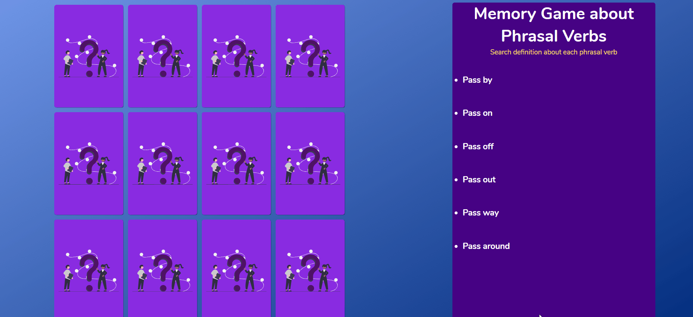

<h1 align="center">
	Jogo da Memória
</h1> 

  <a href="https://memorygamepv.netlify.app/" target="_blank">Demo on Netlify
  </a>

&nbsp;&nbsp;

  <a href="#-projeto">Projeto</a>&nbsp;&nbsp;&nbsp;|&nbsp;&nbsp;&nbsp;
  <a href="#-tecnologias">Tecnologias</a>&nbsp;&nbsp;&nbsp;|&nbsp;&nbsp;&nbsp;
  <a href="#-licença">Licença</a>

&nbsp;&nbsp;

---

&nbsp;&nbsp;

## 💻 Projeto

Diferente da maioria dos jogos de memória, este temos que encontrar as definições corretas de cada Phrasal Verb da lista.

Um verbo pode ter vários significados quando composto com preposições e advérbios e para ajudar a estuda-los eu revolvi fazer este Jogo da memória, que temos que encontrar não uma imagem igual a outra, mas sim o phrasal verb com a definição dele.

Quando o usuário jogar, precisará ler cada carta e irá fixar as definições e não as traduções, ajudando então nos estudos.

Projeto desenvolvido seguindo este [Tutorial](https://marina-ferreira.github.io/tutorials/js/memory-game.pt-br/)

&nbsp;&nbsp;

---

&nbsp;&nbsp;

## 🚀 Tecnologias

O projeto foi desenvolvido usando as seguintes tecnologias

- [HTML](https://developer.mozilla.org/pt-BR/docs/Web/HTML)
- [CSS](https://developer.mozilla.org/pt-BR/docs/Web/CSS)
- [JavaScript](https://developer.mozilla.org/pt-BR/docs/Web/JavaScript)

&nbsp;&nbsp;

---

&nbsp;&nbsp;

## 📂 Licença

Distribuído sob a licença MIT. Veja `LICENSE` para mais informações.